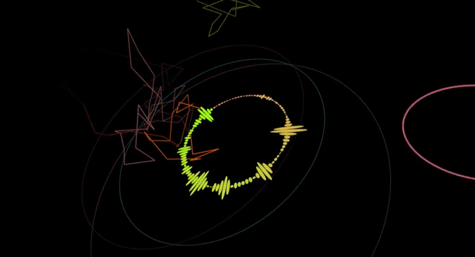
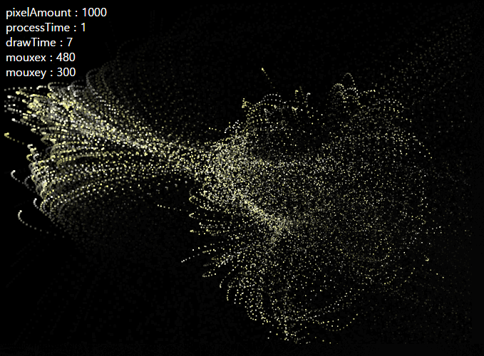
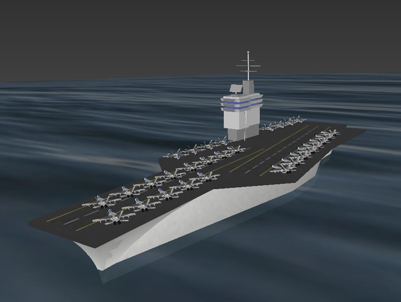

# graphics
my graphics works  
 

- **Maidragon fractal** _ *2017/03/05*  
`canvas`  
 
  
 

- **[Audio Visualization] The words of god** _ *2016/11/04*  
`processing`  
 
  
 

- **3D Scanner** _ *2015/09/23*  
`three.js`  
 
  
 

- **Particle engine** _ *2014/03/08*  
`canvas`  
 
  
 

- **Aircraft Carrier** _ *2012/04/29*  
`vrml`  
 
  
 
